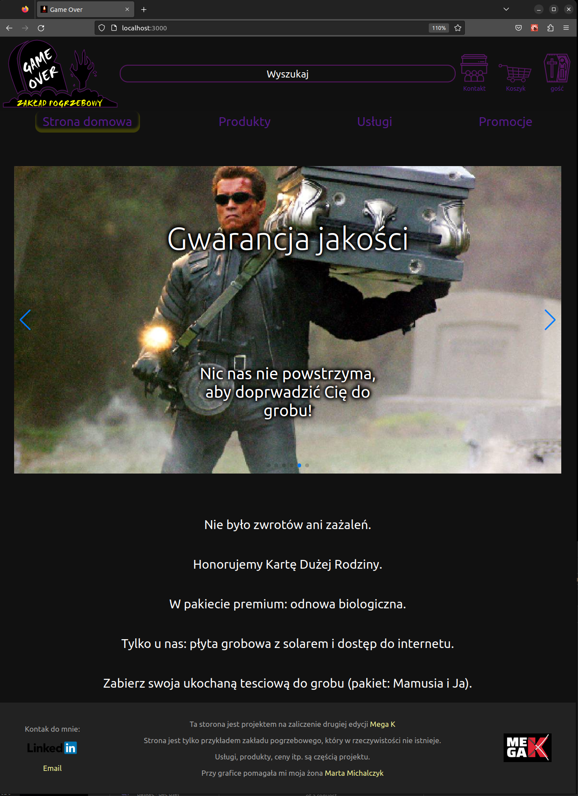

# Projekt na zaliczenie

<p align="center">
  <a href="https://www.megak.pl/" target="_blank" rel="noreferrer"> 
  </a>
</p>

# Front End

Projekt na zaliczenie drugiej edycji [Mega Kursu JavaScriptu MegaK](https://www.megak.pl)

To jest **front end** napisany w ***React***

Do prawidłowego działania, wymagany jest **back end** dostępny pod [tym adresem](https://github.com/Keszua/megak-game-over-back/)

<hr/>

## Opis projektu
Przykład strony dla zakładu usługowego.
- projekt wyglądu (logo, ikony, stylowanie)
- slidery (przykładowy wygląd)
- przykład listy produktów (pobieranych z bazy danych)
- karta produktu (dane pobierane z bazy)
- karta edycji produktu (zmiany zapisywane do bazy danych)
- przykład karty "konatakt" z mapą
- rejstracja, logowanie (autoryzacja i autentykacja po stronie serwera)
- urzycie aktualnych technologii oraz trendów:
    - React Hooks
    - React Context
    - React Routing
    - pobieranie danych za pomocą Fetch API
    - REST API (GET, POST, PUT i DELETE)
    - asynchroniczna kod (IIFE, async / await)
    - obsługa błędów (try / catch)
    - grafika wektorowa SVG (aktywne ikony, reagujące na aktualny stan na stronie)
    - podział projektu na moduły (wydzielone widoki, komponenty)


Przy grafice i stylowaniu pomagała mi moja żona [Marta Michalczyk](https://pl.linkedin.com/in/marta-michalczyk-099043205/)


<hr/>

## Zastosowane języki i technologie
<p align="center">
  <a href="https://reactjs.org/" target="_blank" rel="noreferrer"> 
  </a> 
</p>
<p align="center">
  <a href="https://www.w3.org/html/" target="_blank" rel="noreferrer">  
  </a> 
  <a href="https://www.w3schools.com/css/" target="_blank" rel="noreferrer">
   
  </a> 
  <a href="https://developer.mozilla.org/en-US/docs/Web/JavaScript" target="_blank" rel="noreferrer"> 
  </a> 
  <a href="https://www.typescriptlang.org/" target="_blank" rel="noreferrer"> 
  </a> 
  <a href="https://git-scm.com/" target="_blank" rel="noreferrer">  
  </a>
  <a href="https://github.com/" target="_blank" rel="noreferrer">  
  </a> 
</p>


## Zadania

- [x] Instalacj Reacta w wersji TypeScript
- [x] Założenie repozytorium na GitHub
- [x] Przygotowanie pliku README
- [x] Konfiguracj Git i wypchniecie projektu na zdlane repozytorium
- [x] Połączenie wspólnych typów FE i BE
- [x] Projekt podziału strony
- [x] Projekt przykładowego nagłówka
- [x] Projekt docelowego nagłówka
- [x] Projekt przykładowej stopki
- [x] Projekt docelowej stopki
- [x] Widoki i Routing
- [x] Dostosowanie stylowania do widoku na urządzenia mobilne
- [ ] Slidery na pierwszej stronie
    - [x] Wstawienie przykładowych sliderów
    - [ ] Obsługa docelowych sliderów (teksty i obrazy zaczytywane z bazy danych)
- [ ] Obsługa okienka z wyszukiwaniem
- [x] Projekt widoku podstrony z ofertami
- [x] Projekt widoku podstrony z edycją oferty
    - [x] Obsługa dodawania oferty
    - [x] Obsługa edycji oferty
    - [x] Obsługa usuwania oferty
    - [ ] Obsługa dodawania obrazków do ofert
- [ ] Paginacja 
- [x] Obsługa logowania
    - [x] Projekt formularza logowania
    - [x] Projekt formularza Zakłądania nowego konta
    - [x] Projekt strony "jesteś zalogowany"
- [x] Obsługa koszyka
    - [x] Projet widoku koszyka
    - [ ] Edycja prduktów w koszyku (zmiana ilości produktów, usówanie produktu)

 
<hr/>

## Zrzutu ekranu

### Widok strony głównej w pełnej szerokości
<p align="center">
   
</p>

### Widok strony głównej w na wąskim ekranie
<p align="center">
   
</p>


### Formularz logowania
<p align="center">
   
</p>

### Formularz zakładania nowego konta
<p align="center">
   
</p>

### Potwierdzenie logowania

Po prawidłowym zalogowaniu się, zmienia sie ikona w prawym górnym rogu.

<p align="center">
   
</p>

### Lista produktów
<p align="center">
   
</p>

### Widok produktu lub usługi

Zalogownay użytkownik ma mozliwość dodania produktu lub usługi do koszyka.

Administrator ma możliwość edytowania produktu.

<p align="center">
   
</p>

### Widok edycji produktu lub usługi

<p align="center">
   
</p>

### Widok koszyka

Po dodaniu produktu lub usługi do koszyka, zmienia się ikona koszyka.

<p align="center">
   
</p>

### Widok strony: kontakt

Miejscowość prawdziwa.

Ulica wymyślona.

<p align="center">
   
</p>


<hr/>

## Uruchomienie

Repozytorium współdziała z częścią back-endową, którą można znaleźć pod [tym adresem](https://github.com/Keszua)

#### Uruchomienie projektu na swojej lokanej maszynie

Sklonuj repozytorium na swój dysk

```bash
git clone https://github.com/Keszua/megak-game-over-front.git
```

Wejdz do folderu *project* i pobierz wymagane zależnosci

```bash
cd project
npm install
```

Uruchomienie projektu

```bash
npm start
```

Zostanie uruhomiony serwer [http://localhost:3000](http://localhost:3000) na którym dostępna będzie strona z projektem.
Pamietaj, że pełna funkcjonalność projektu wymaga uruchomienia backendu [link na początku opisu](#Projekt-na-zaliczenie-Front-End)

Uruchomienie w trybie watch mode

```bash
npm run start:dev
```

Stworzenie wersji produkcyjnej

```bash
npm run start:prod
```

<hr/>

## Kontakt

Mój profil na <a href="https://www.linkedin.com/in/karol-michalczyk-keszua83/" target="_blank" rel="noreferrer">  
</a>

#### mail: [Gmail](mailto:keszua@gmail.com)

<hr/>
